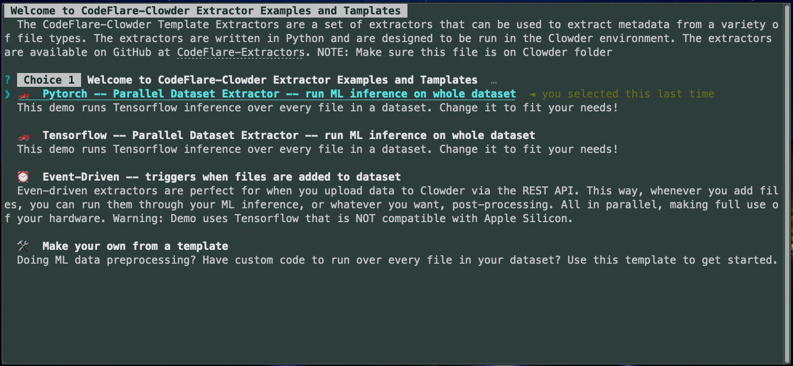
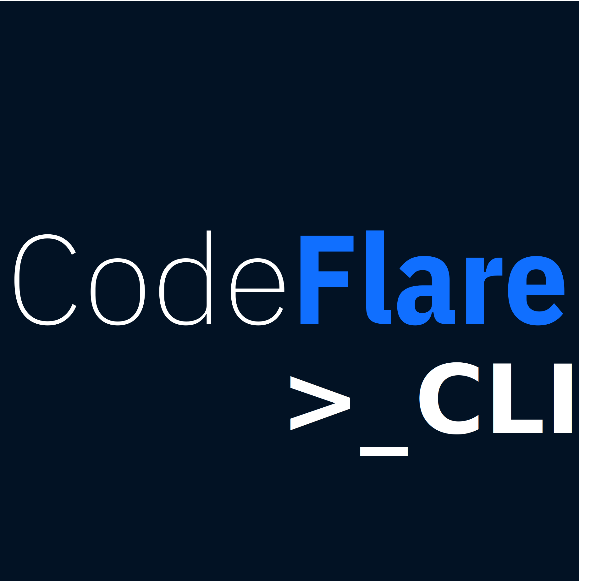

<div align="center">
<p align="center">

<!-- prettier-ignore -->
<h1> Clowder Framework Data Processors</h1>

**The open-source tool for Long Tail Data Management**

<!-- prettier-ignore -->
<a href="https://clowderframework.org/">Website</a> •
<a href="https://clowder-framework.readthedocs.io/en/latest/userguide/installing_clowder.html">Install</a> •
<a href="https://clowder-framework.readthedocs.io/en/latest/">Docs</a> •
<a href="https://github.com/clowder-framework/CodeFlare-Extractors/tree/main/template_for_custom_parallel_batch_extractors">Make your own from a Template</a> •
<a href="https://clowder.ncsa.illinois.edu/clowder/">Try it now</a>

Join our Slack to talk to the devs 

[](https://clowder-software.slack.com/join/shared_invite/enQtMzQzOTg0Nzk3OTUzLTYwZDlkZDI0NGI4YmI0ZjE5MTZiYmZhZTIyNWE1YzM0NWMwMzIxODNhZTA1Y2E3MTQzOTg1YThiNzkwOWQwYWE#/shared-invite/email)

[](https://clowder-framework.readthedocs.io/en/latest/userguide/installing_clowder.html)

CodeFlare + Clowder makes it easy to run ML inference and similar workloads over your files, no matter how unique your data is.

</p>
</div>

---

## Why Extractors?

At its heart, **extractors run a Python function over every file in a dataset**. They can run at the click of a button in Clowder web UI or like an event listener every time a new file is uploaded.

Extractors are performant, parallel-by-default, web-native [Clowder Extractors](https://github.com/clowder-framework/pyclowder) using [CodeFlare](https://research.ibm.com/blog/codeflare-ml-experiments) &amp; [Ray.io](https://www.ray.io/).

Check out our [📜 blog post on the incredible speed and developer experience](https://github.com/clowder-framework/CodeFlare-Extractors/blob/main/utils/media/Getting_Started_with_Ray_Workflows.pdf) of building on Ray.

### 🧠 ML Inference

Need to process a lot of files? **This is great for ML inference and data pre-processing**. These examples work out of the box or you can swap in your own model!


[PyTorch example](https://github.com/clowder-framework/CodeFlare-Extractors/tree/main/parallel-batch-ml-inference-pytorch)
<br>
<br>


[TensorFlow Keras example](https://github.com/clowder-framework/CodeFlare-Extractors/tree/main/parallel_batch_ml_inference)
<br>
<br>


[Huggingface Transformers example](https://github.com/clowder-framework/CodeFlare-Extractors/tree/main/parallel-batch-ml-inference-huggingface)
<br>
<br>

### 🔁 Event-driven

Have daily data dumps? **Extractors are perfect for event-driven actions**. They will run code every time a file is uploaded. Uploads themselves can be automated via [PyClowder](https://github.com/clowder-framework/pyclowder) for a totally hands-free data pipeline.

### Clowder's rich scientific data ecosystem

Benefit from the rich featureset & full extensibility of Clowder:
* Instead of files on your laptop, use Clowder to add collaborators & share datasets via the browser.
* Scientists like that we work with every filetype, and have rich extensibility for any job you need to run.


## 🚀 Quickstart install
1. Clone this repo inside your [Clowder](https://github.com/clowder-framework/clowder) directory (or [install Clowder](https://clowder-framework.readthedocs.io/en/latest/userguide/installing_clowder.html) if you haven't yet):


```bash
cd your/path/to/clowder
git clone git@github.com:clowder-framework/CodeFlare-Extractors.git
```
<br>

2. Install [CodeFlare-CLI](https://github.com/project-codeflare/codeflare-cli) 



```bash
brew tap project-codeflare/codeflare-cli https://github.com/project-codeflare/codeflare-cli
brew install codeflare
```
On Linux, please install from source, as described in the [CodeFlare-CLI repo](https://github.com/project-codeflare/codeflare-cli). Windows has not been tested.


## Usage

Invoke from **inside your Clowder directory,** so that we may respect Clowder's existing Docker Compose files. 

1. Launch the codeflare CLI to try our default extractors. This will launch Clowder. Do *not* use sudo. 

```bash
cd your/path/to/clowder 
codeflare ./CodeFlare-Extractors
```

2. Now, as an example, upload a few images to a [Clowder Dataset](https://clowder-framework.readthedocs.io/en/latest/userguide/ug_datasets.html) so we can try to classify it (into one of 1000 imagenet classes).

3. Finally, run the extractor! In the web app, click “Submit for extraction” (shown below).


## 🛠 Building your own
Start from our heavily documented & commented template here. Just fill in _a single python function_ and add dependencies to the requirements.txt (or Dockerfile for infinitly complex projects)! [`./template_for_custom_parallel_batch_extractors`](https://github.com/clowder-framework/CodeFlare-Extractors/tree/main/template_for_custom_parallel_batch_extractors).

#### Worked example
Here we can walk thru exactly what to modify. It's really as easy filling in this function, and we'll run it in parallel over all the files in your dataset.

There are just two parts: An `init()` that runs once per thread to setup your ML model, or other class variables. And a `process_file()` that runs, you guessed it, once per file. 

```python
@ray.remote
class AsyncActor:
    def __init__(self):
        """
        ⭐️ Here, define global values and setup your models. 
           This code runs a once per thread, if you're running this in parall, when your code first launches.
        
        For example:
        ```
        from tensorflow.keras.applications.resnet50 import ResNet50
        self.model = ResNet50(weights='imagenet')
        ```
        """
        self.model = 'load your model here' # example

    def process_file(self, filepaths: str):
        """
        ⭐️ Here you define the action taken for each fo your files. 
        This function will be called once for each file in your dataset, when you manually click 
        "extract this dataset"
        param filepath: is a single input filepath
        return {Dictionary}: Return any dictionary you'd like. It will be attached to this file as Clowder Metadata.
        """
        print("In process file \n")
        start_time = time.monotonic()

        # 👉 ADD YOUR PARALLEL CODE HERE 
        # For example:
        prediction = self.model.run(filepath) 

        # return your results, it MUST return a Python dictionary.
        metadata = {
            "Predicted class": 'happy cats!', # for example
            "Extractor runtime": f"{start_time - time.monotonic():.2f} seconds",
        }

        assert type(metadata) == Dict, logger.debug(f"The returned metadata must be a Dict, but was of type {type(metadata)}")
        return metadata
```
To see debug steps in the Clowder web UI, which is often helpful, simply use `logger.debug(f"My custom message")`. The logger is already available in your environment.

(Coming soon) By default, the code will detect your number of availbe CPU threads, and spawn one worker per thread, likely the only time you'll want to use less is if you anticipate out of memory errors.

## Event driven vs Whole Dataset extractors
This is defined in each extractor's `extractor_info.json` file, which defines how the extractor appears inside Clowder. You can also change the extractor's name and add authors there. 

#### File added, like an event listener: 
```json
"dataset": [
  "file-added"
]
```
#### Whole Dataset (in parallel by default):
```json
"dataset": [
  "*"
]
```
#### File-level
This won't run on datasets, it is for cases where you want to manually click on a file, then run just that one file through an extractor. 
```json
"file": [
  "*"
]
```

### Trigger on specific filetypes 
Here's a list of common filetypes (i.e. MIME types) that we support: https://developer.mozilla.org/en-US/docs/Web/HTTP/Basics_of_HTTP/MIME_types/Common_types. 

You can use a list of these MIME type strings in the extractors, then it will only run on those files. For example:

```json
"dataset": [
  "image/jpeg",
  "image/png",
  "image/tiff"
]
```

### Understanding the CodeFlare CLI

**What:** Running the CodeFlare-CLI build the selected extractor's Dockerfile adds it to Clowder’s `docker-compose-extractors.yaml` file. Immediately after, we start Clowder as normal, e.g. `docker-compose -f docker-compose.yml -f docker-compose.extractors.yml up -d`. All codeflare code lives in `index.md` because index files are run by default. But any CodeFlareCLI-compatible `.md` file can be run by calling `codeflare my_file.md` to launch new CLI programs.

**How:** It uses a pretty involved customization on layer top of normal markdown syntax to enable interactive CLIs called [MDWizzard](https://github.com/guidebooks/madwizard), an open source project from IBM.

## Documentation

* [Extractor overview](https://clowder-framework.readthedocs.io/en/latest/develop/extractors.html)

* [Extractor Details](https://opensource.ncsa.illinois.edu/confluence/display/CATS/Extractors#Extractors-Extractorbasics)

* [PyClowder Extractors Source](https://github.com/clowder-framework/pyclowder)

